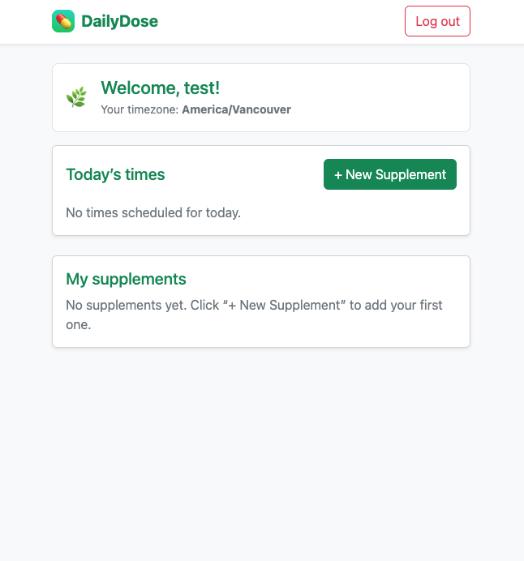
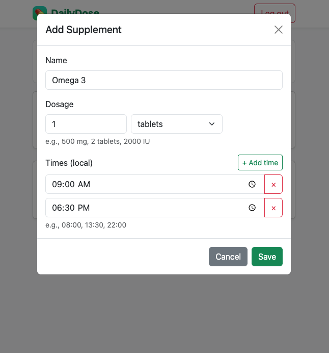
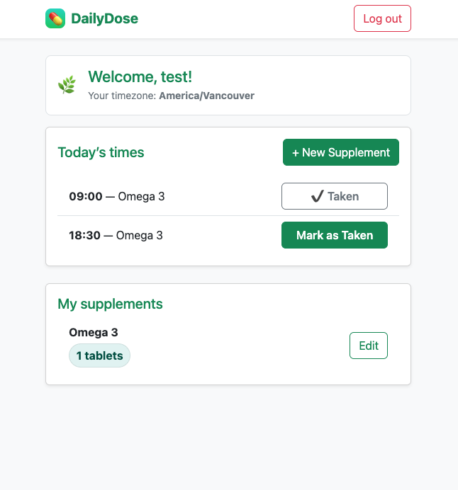

# 💊 DailyDose

> A modern supplement & medication tracker — built with **Node.js**, **Express**, and **PostgreSQL**.

---

## 🧭 Overview

DailyDose helps users **stay consistent with their supplements and medication routines**.  
You can **sign up**, **log in**, **add supplements with dosage and scheduled times**, and **mark them as taken or undone** easily from your dashboard.

---

## ✨ Features

✅ **User Authentication** (Signup / Login / Logout)  
💊 **Supplement Management** (Add, Edit, Delete)  
⏰ **Daily Schedule Tracking** — See all times for today  
🔁 **Mark as Taken / Undo Taken** toggle  
🌐 **Timezone support** for accurate scheduling  
🎨 **Responsive design** using **Bootstrap 5**  
🕓 **The dashboard automatically refreshes supplement statuses daily based on the user's timezone**

---

## 🏗️ Tech Stack

| Layer | Technology |
|-------|-------------|
| **Backend** | Node.js, Express |
| **Database** | PostgreSQL |
| **Frontend** | EJS, Bootstrap 5 |
| **Auth** | express-session + connect-pg-simple |
| **Validation** | Joi |
| **Password Hashing** | bcrypt |

---

## 📂 Project Structure

```
DailyDose/
├── controllers/        # Route logic (auth, dashboard, supplements, dose)
├── middleware/         # Auth middleware (requireLogin)
├── public/
│   ├── css/            # style.css (minimal theme)
│   └── js/             # today.js, supplements.js, etc.
├── routes/             # Express route files
├── views/              # EJS templates (login, signup, dashboard, 404)
├── db.js               # PostgreSQL connection pool
├── index.js            # Entry point (Express server)
├── .env                # Environment variables (ignored by .gitignore)
└── package.json
```

---

## ⚙️ Setup Instructions

### 1️⃣ Clone the repository

```bash
git clone https://github.com/<your-username>/DailyDose.git
cd DailyDose
```

### 2️⃣ Install dependencies

```bash
npm install
```

### 3️⃣ Configure environment variables

Create a `.env` file in the project root:

```env
DB_USER=your_db_user
DB_PASSWORD=your_password
DB_NAME=your_database
DB_HOST=localhost
SESSION_SECRET=your_secret_key
PORT=3000
```

### 4️⃣ Initialize the database

Make sure your PostgreSQL database has the following tables:

- `app_user`
- `supplement`
- `supplement_time`
- `dose_log`
- `session`

> (See `controllers/` for schema references)

### 5️⃣ Run the application

```bash
npm start
```
Then open → [http://localhost:3000](http://localhost:3000)

---

## 📸 Screenshots

| Dashboard | Add Supplement | Mark as Taken |
|------------|----------------|----------------|
|  |  |  |

> *(Add your own screenshots inside `/docs/screens/` folder)*

---

## 🗂️ Database ERD (Example)

```
APP_USER (user_id PK)
│
├─< SUPPLEMENT (supplement_id PK, FK user_id)
│     ├─< SUPPLEMENT_TIME (time_id PK, FK supplement_id)
│     └─< DOSE_LOG (log_id PK, FK supplement_id)
│
└─< SESSION (for express-session)
```

---

## 🧪 Example User Flow

1. **Sign up** with your email and password.  
2. **Add supplements** with dosage & times (e.g., *Vitamin D3 – 500 IU – 08:00, 22:00*).  
3. **Dashboard shows today’s times** with “Mark as Taken” buttons.  
4. Toggle each as you take them — instantly updates your schedule.

---

## 🚀 Future Improvements

- [ ] Email or mobile notifications  
- [ ] Weekly adherence statistics  
- [ ] Mobile PWA support  
- [ ] Dark mode toggle  

---

## 📜 License

This project is created for **educational purposes (BCIT CST Term 2)**.  
Feel free to fork, modify, and extend it for personal learning.

---

👨‍💻 **Author:** Minsu Kim  
📧 [mkim381@my.bcit.ca](mailto:mkim381@my.bcit.ca)  
🌐 [https://github.com/mskim9097](https://github.com/mskim9097)
